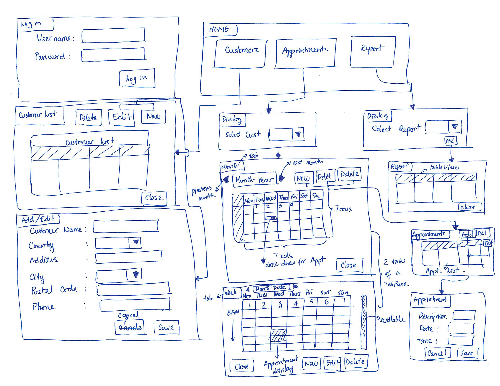
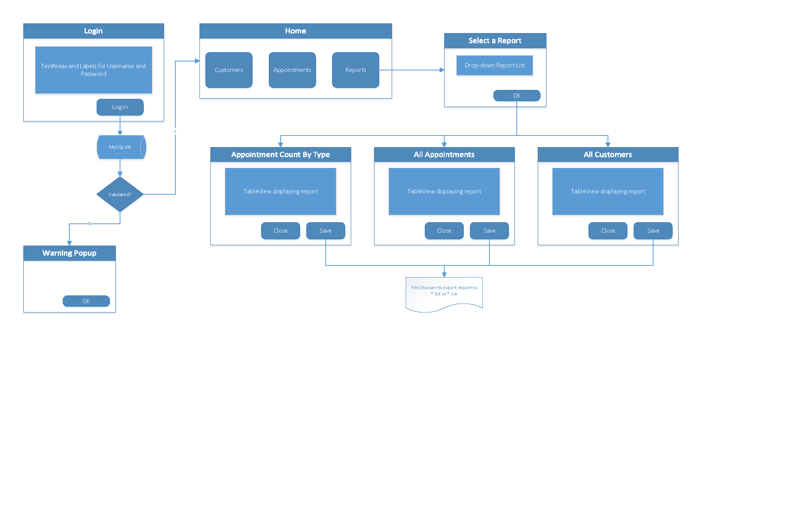
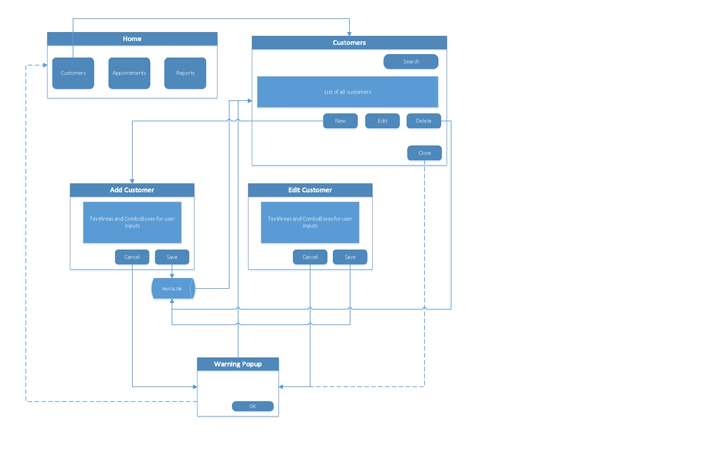
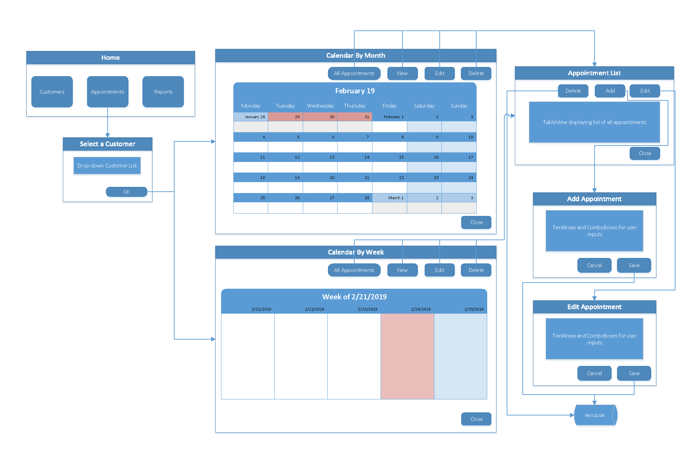

### Design:

1.	I started the design process with a napkin-sketch of the GUI. 

2. I then put together a wireflow diagram, which was used throughout the coding process. 

3. The Entity Relationship Diagram (ERD) for the database design is shown below. 

4. The Model-View-Controller (MVC) design pattern was used to organize the source code for this application.

### Final Product:

1.	I started the design process with my napkin-sketch of the GUI. 